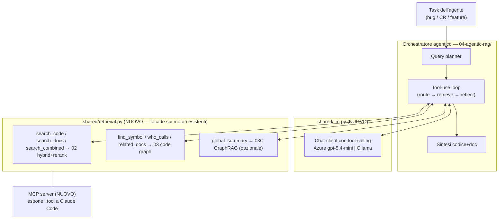

# Tappa 04 — Agentic RAG (design)

> **Stato: pianificato.** Questo documento spiega *come funziona* l'Agentic RAG
> **rispetto a quello che abbiamo già** (Tappe 01–03) e quali **modifiche concrete**
> servono per costruirlo. È un documento di design da approvare prima di implementare.
> Visione complessiva: [architettura target dual-RAG](../wiki/syntheses/architettura-target.md).

---

## 1. Il salto concettuale: da retrieval a *agente che recupera*

Tutto ciò che abbiamo oggi (01 dense, 02 hybrid+rerank, 03 graph) è **retrieval
single-shot a flusso fisso**:

```
query ──► [un retriever scelto a mano] ──► risultati
```

L'utente decide *a priori* quale motore usare (`search.py`, `hybrid.py --mode`,
`graph_query.py def|callers|docs`), la query passa **una volta sola**, e l'unica
"fusione" è meccanica (RRF) — nessuna decisione, nessuna iterazione, nessun LLM nel
loop di orchestrazione.

L'**Agentic RAG** mette un **LLM-orchestratore davanti ai retriever** e trasforma il
recupero in un **loop a più passi guidato dal ragionamento**:

```
task (bug / CR / feature)
   │
   ▼
[PLAN]  decompone in sotto-domande
   │
   ▼
[ROUTE] sceglie il tool giusto per ciascuna   ──► search_code | search_docs
   │                                               who_calls | find_symbol | ...
   ▼
[RETRIEVE] esegue i tool (anche multi-hop)
   │
   ▼
[REFLECT] il contesto basta a rispondere?  ──no──► riformula / approfondisci (torna a ROUTE)
   │ sì
   ▼
[SYNTHESIZE] fonde codice + doc in una risposta citata
```

La differenza non è "un retriever migliore": è **chi guida**. Prima guidava l'utente
con un comando; ora guida un agente che pianifica, sceglie gli strumenti, valuta se ha
abbastanza contesto e itera.

---

## 2. Confronto puntuale

| Dimensione | Ora (01–03) | Agentic RAG (04) |
|---|---|---|
| **Controllo del flusso** | fisso, deciso dall'utente via CLI | dinamico, deciso dall'LLM a runtime |
| **Passi di retrieval** | uno | N (iterativo, fino a contesto sufficiente) |
| **Scelta del motore** | manuale (`--mode`, sottocomando) | routing automatico per sotto-query |
| **Query** | usata così com'è | decomposta + riformulata |
| **Multi-hop** | solo manuale su 03 (`def`→`callers`) | automatico (segue gli archi finché serve) |
| **Fusione codice↔doc** | assente o meccanica (RRF) | ragionata dall'agente |
| **LLM nel loop** | no (solo dentro GraphRAG, offline) | sì, è il motore dell'orchestrazione |
| **Output** | lista di hit | risposta sintetizzata + citazioni a file/simboli |
| **Consumo** | CLI per umani | **tool MCP** per agenti (Claude Code, AutoGen, SK) |

---

## 3. Architettura della Tappa 4



Punto chiave: **non riscriviamo i retriever**. L'agentic RAG è un **layer sopra** le
Tappe 01–03. Le modifiche servono a (a) rendere i motori richiamabili in modo pulito e
uniforme, (b) aggiungere il cervello (LLM con tool-calling), (c) esporli agli agenti (MCP).

---

## 4. Modifiche concrete da apportare

Mappate sui file reali, dal più fondante al più esterno.

### 4.1 `shared/llm.py` — client chat con tool-calling *(NUOVO, prerequisito)*
È il pezzo mancante. Oggi `shared/` ha solo l'embeddings layer; serve l'equivalente per
il **completion/chat**, con lo stesso pattern intercambiabile:
- Azure OpenAI **`gpt-5.4-mini`** (il deployment `azure_chat` è **già in `config.py`** e
  già usato da GraphRAG) — endpoint v1, `chat/completions`, supporto `tools`.
- Ollama locale (es. `llama3.1`) per la traccia local-first, anch'esso con tool-calling.
- API minima: `chat(messages, tools=None) -> {content, tool_calls}`.

### 4.2 `shared/retrieval.py` — facade unica sui motori *(NUOVO)*
I retriever esistono ma sono sparsi e importati con hack `sys.path` tra cartelle. Serve
una **facciata pulita** che l'agente (e l'MCP) chiamano senza conoscere i dettagli:

| Tool | Implementazione (riusa) | Stato attuale |
|---|---|---|
| `search_code(q, k)` | `02 HybridIndex.search(mode=hybrid)` filtrando `source=code` | esiste, da filtrare per `source` |
| `search_docs(q, k)` | `02 HybridIndex.search` filtrando `source=doc` | esiste, da filtrare per `source` |
| `search_combined(q, k)` | hybrid + rerank su entrambi i corpora | `rerank()` esiste |
| `find_symbol(name)` | `03 CodeGraph` def | esiste |
| `who_calls(name)` | `03 CodeGraph` callers | esiste |
| `related_docs(name)` | `03 CodeGraph` docs/mentions | esiste |
| `global_summary(topic)` | `03C GraphRAG` global search *(opzionale, a pagamento)* | esiste |

> Nota: oggi `HybridIndex` non filtra per `source`; va aggiunto un filtro sui metadati
> (`source=code|doc`) per separare i due corpora — abilita la **fusione ragionata**.

### 4.3 `04-agentic-rag/` — l'orchestratore *(NUOVO, cuore della tappa)*
Il loop plan → route → retrieve → reflect → synthesize, costruito su un framework di
orchestrazione (vedi [decisioni aperte](#6-decisioni-aperte)). Include:
- definizione degli **schemi dei tool** (nome, descrizione, parametri) per il function-calling;
- la **policy di iterazione** (quando fermarsi, budget di passi/token);
- la **sintesi finale** con citazioni a `path:lineno`/`qualname`.

### 4.4 MCP server — interfaccia per gli agenti *(NUOVO)*
Wrappa i tool di `retrieval.py` come **server MCP**, così Claude Code li usa nativamente
(`search_code`, `search_docs`, `who_calls`, ...). È la decisione "MCP-first"
dell'architettura target: stesso backend, più frontend (Claude Code ora, AutoGen/SK poi).

### 4.5 Valutazione *(NUOVO)*
Le eval attuali (`evaluate.py`) misurano un singolo passo (hit-rate@k, MRR). L'agentic va
valutato **end-to-end** su task multi-step: dato un task, l'agente fa emergere i file/simboli
giusti e li sintetizza correttamente? Serve un piccolo eval set di task (bug/CR/feature) con
contesto atteso, ed eventualmente una valutazione della *traiettoria* (quali tool ha chiamato).

### 4.6 Ambiente
`requirements`/venv per il framework scelto (AutoGen / Semantic Kernel / LangGraph) +
dipendenza MCP. Se in conflitto con lo stack attuale, **venv isolato** come per GraphRAG.

### Checklist sintetica
- [ ] `shared/llm.py` — chat client (Azure gpt-5.4-mini + Ollama) con tool-calling
- [ ] `shared/retrieval.py` — facade `search_code/docs/combined`, `find_symbol/who_calls/related_docs`
- [ ] filtro `source=code|doc` in `HybridIndex`
- [ ] `04-agentic-rag/` — orchestratore (plan/route/retrieve/reflect/synthesize)
- [ ] schemi tool per function-calling
- [ ] MCP server che espone i tool
- [ ] eval multi-step + eval set di task
- [ ] requirements/venv + dipendenza MCP

---

## 5. Cosa NON cambia

- Gli indici (Chroma, BM25, code graph, GraphRAG) e il chunking: l'agentic li **consuma**, non li sostituisce.
- Il principio **local-first** (Ollama) con Azure via `RAG_BACKEND`.
- Le Tappe 01–03 restano eseguibili e valutabili in autonomia.

---

## 6. Decisioni prese (2026-05-29)

1. **Framework di orchestrazione → confronto di tutti e tre.** Coerente con lo spirito del
   workspace (come il confronto multi-provider sugli embedding), la Tappa 4 **confronta**
   AutoGen, Semantic Kernel e LangGraph sullo **stesso orchestratore** e sugli stessi tool.
   Si procede **sequenzialmente**: prima **AutoGen** (completo, fino a eval), poi si riprende
   con Semantic Kernel e infine LangGraph. L'orchestratore e i tool sono indipendenti dal
   framework, così il confronto è a parità di tutto il resto.
2. **LLM dell'agente → intercambiabile via `RAG_BACKEND`.** Come l'embeddings layer:
   `shared/llm.py` espone un client unico con due tracce — **Ollama `llama3.1`** (default
   locale, gratis) e **Azure `gpt-5.4-mini`** (già configurato, tool-calling più solido) —
   selezionate da config. Local-first di default, Azure attivabile senza toccare il codice.
3. **Superficie → libreria-first, poi MCP.** Prima l'orchestratore Python richiamabile e
   **testabile** (CLI + pytest), poi lo si wrappa come **server MCP** per Claude Code. MCP
   resta l'obiettivo (architettura target), ma come ultimo passo dopo aver validato il loop.

### Implicazioni sulla struttura

```
04-agentic-rag/
├─ README.md            ← questo design
├─ orchestrator.py      ← il loop plan/route/retrieve/reflect/synthesize (agnostico dal framework)
├─ tools.py             ← schemi dei tool sopra shared/retrieval.py
├─ autogen_app.py       ← adattatore AutoGen        (1° — implementare per primo)
├─ sk_app.py            ← adattatore Semantic Kernel (2°)
├─ langgraph_app.py     ← adattatore LangGraph       (3°)
├─ mcp_server.py        ← (ultimo) espone i tool a Claude Code via MCP
└─ evaluate.py          ← eval multi-step su task (bug/CR/feature)
```

> **Prossimo step operativo:** i prerequisiti trasversali — `shared/llm.py` (chat client
> intercambiabile) e `shared/retrieval.py` (facade sui motori) — poi l'adattatore **AutoGen**
> end-to-end fino all'eval, infine SK e LangGraph.
