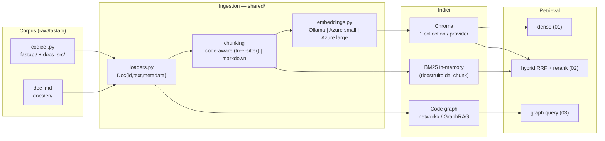

# Sertor — toolset RAG per codice + documentazione

Workspace di **esplorazione e apprendimento** per confrontare diversi approcci
**RAG** (Retrieval-Augmented Generation) in Python, con focus sull'ecosistema
**Microsoft/Azure**. L'obiettivo strategico non è un esperimento monouso sul corpus
campione, ma costruire un **toolset riproducibile e repo-agnostico**, portabile dentro
un progetto Enterprise: dato un repository (codice + documentazione), fornire ad agenti
di sviluppo (Claude Code, AutoGen, Semantic Kernel) un **contesto fuso codice+doc**.

> **Questo file spiega *come funziona* il sistema.** Per il dettaglio operativo dei
> comandi vedi [`DEMOS.md`](DEMOS.md); per esempi divulgativi "ho cercato X → mi ha
> restituito Y" vedi [`ESEMPI.md`](ESEMPI.md); per il ragionamento di progetto e i
> learning vedi il [`wiki/`](wiki/index.md).

---

## A colpo d'occhio

Il workspace segue la convenzione **"una cartella per approccio"**, ciascuna
auto-contenuta ed eseguibile **in locale** (local-first), con i servizi **Azure
attivabili via config** (variabile `RAG_BACKEND`). Lo stato attuale:

| Tappa | Cartella | Approccio | Cosa aggiunge | Stato |
|---|---|---|---|---|
| **01** | `01-baseline/` | Dense vector retrieval | chunking code-aware + embeddings + similarity search su Chroma | ✅ completato |
| **02** | `02-hybrid-reranking/` | Hybrid + reranking | BM25 (lessicale) + dense fusi con RRF + cross-encoder | ✅ completato |
| **03A** | `03-graphrag/` | Code graph (AST) | knowledge graph del codice via `ast` (def/callers/import/inherits) | ✅ completato |
| **03C** | `03-graphrag/` | Microsoft GraphRAG | grafo LLM-extracted con entity_types di dominio | ✅ completato |
| **04** | `04-agentic-rag/` | Agentic RAG | orchestrator (query planning, retrieval iterativo) esposto via **MCP** | ⏳ pianificato |

Il punto d'arrivo (Tappa 4) e il disegno completo sono descritti nella sintesi
[architettura target — dual-RAG](wiki/syntheses/architettura-target.md).

---

## Come funziona: la pipeline

Tutte le tappe condividono la stessa spina dorsale **ingestion → indici → retrieval**.
Ciò che cambia da una tappa all'altra è *quanti* e *quali* indici si interrogano e come
si fondono i risultati.



**In sintesi:** il corpus viene caricato come oggetti `Doc`, spezzato in chunk
(con strategia diversa per codice e documentazione), trasformato in vettori da un
provider di embedding intercambiabile, e salvato in Chroma. Da lì il retrieval può
essere puramente denso (01), ibrido lessicale+denso con reranking (02), oppure
strutturale su un grafo del codice (03).

---

## I componenti, uno per uno

### 1. Config centralizzata e switch backend — `shared/config.py`

Un'unica dataclass `Settings` legge il file **`.env`** (con `override=True`, così il
`.env` vince sulle variabili d'ambiente di sistema) ed espone tutti i settaggi: host
Ollama, chiavi/endpoint Azure, deployment, percorsi, e i due selettori chiave:

- **`RAG_BACKEND`** (`local` | `azure`) — alterna l'intero stack senza toccare il codice.
- **`CODE_CHUNKER`** (`treesitter` | `recursive`) — sceglie la strategia di chunking del codice.

Nessuna cartella duplicata per "locale vs Azure": la differenza è solo configurazione.

### 2. Loaders — `shared/loaders.py`

Trasforma i file del corpus in `Doc{id, text, metadata}`. Distingue due **sorgenti**:
- `load_code()` → file `.py` di `fastapi/` (`kind=code`) e `docs_src/` (`kind=example`);
- `load_docs()` → Markdown di `docs/en/` (`source=doc`, `kind=markdown`).

Il `metadata.source` (`code` | `doc`) è ciò che permetterà, a valle, la **fusione
codice↔doc**.

### 3. Chunking — `01-baseline/chunking.py` + `shared/chunking_code.py`

Il principio guida è **code-aware ≠ text-aware**: il codice non va spezzato a finestre
fisse ma per **unità sintattiche**.

- **Codice (default `treesitter`):** `shared/chunking_code.py` usa il parser
  **tree-sitter** (binding standard `tree-sitter` + grammatica `tree-sitter-python`) per
  produrre un chunk per **funzione top-level** e per **metodo** (con il contesto della
  classe prepeso), più i chunk a livello di modulo. Ogni chunk porta metadati
  strutturali: `symbol`, `symbol_kind` (`module`/`class`/`function`/`method`),
  `qualname`, `start_line`, `end_line`. Se la lingua non è supportata torna `None`
  → fallback automatico al ricorsivo.
- **Codice (fallback `recursive`):** `RecursiveCharacterTextSplitter` di LangChain,
  size-driven (900 char, overlap 120).
- **Documentazione:** sempre splitter Markdown per heading (1200 char, overlap 150).

> I metadati `qualname`/righe sono il **ponte** verso la futura fusione
> grafo↔vettoriale: collegano un chunk vettoriale al nodo corrispondente nel code graph.

### 4. Embeddings — `shared/embeddings.py`

Layer intercambiabile su **3 provider**, stessa interfaccia `embed(texts)`:

| Provider | Modello | Dim | Note |
|---|---|---|---|
| `ollama` | `nomic-embed-text` | 768 | locale, gratis, il più debole su query NL |
| `azure-small` | `text-embedding-3-small` | 1536 | Azure OpenAI (endpoint v1) |
| `azure-large` | `text-embedding-3-large` | 3072 | Azure, il più forte |

Azure usa l'endpoint v1 con header `api-key`; i vettori sono calcolati qui e passati
**espliciti** a Chroma (Chroma non ricalcola nulla).

### 5. Vector store — Chroma (`01-baseline/index.py`)

`PersistentClient` su `01-baseline/.index`, **una collection per provider**
(`baseline_ollama`, `baseline_azure_small`, `baseline_azure_large`), spazio `cosine`.
L'indicizzazione è idempotente (ricrea la collection da zero). Confrontare provider
diversi = interrogare collection diverse, a parità di chunk.

### 6. Hybrid retrieval + reranking — `02-hybrid-reranking/`

Riusa le **stesse** collection della Tappa 1 e aggiunge il ramo **lessicale**:
- **BM25** (`rank_bm25`) ricostruito in memoria sui documenti della collection, con un
  tokenizer che **preserva gli identificatori** e splitta gli `snake_case` nei sotto-token
  (cruciale per le query a simboli esatti del codice).
- **RRF** (Reciprocal Rank Fusion, `c=60`) fonde i ranking dense e sparse.
- **Rerank** (`rerank.py`, cross-encoder / FlashRank) riordina il pool fuso.

Modalità: `--mode dense | sparse | hybrid`. Il `sparse` è **offline** (nessun embedding,
nessuna rete) — utile per demo deterministiche.

> **Finding chiave:** `tree-sitter + hybrid + rerank` dà recupero a simboli **perfetto**
> (azure-large MRR sui simboli **1.000**), mentre il dense puro soffre la frammentazione
> più fine dei chunk di codice.

### 7. Code graph (AST) — `03-graphrag/build_graph.py` + `graph_query.py`

Costruisce un knowledge graph leggero **senza LLM**, parsando il codice con il modulo
`ast` di Python. Nodi: `module`/`class`/`function`/`method`/`doc`. Archi: `contains`,
`imports`, `calls`, `inherits`, `mentions` (doc→simbolo). Persistito in **GraphML**
(networkx). Query strutturali deterministiche e gratuite:

```bash
python 03-graphrag/graph_query.py def     OAuth2PasswordBearer   # definizione + path:lineno
python 03-graphrag/graph_query.py callers HTTPException          # chi la chiama
python 03-graphrag/graph_query.py docs    APIRouter              # doc collegati
```

### 8. Microsoft GraphRAG — `03-graphrag/grag/`

Variante "pesante": il pacchetto **Microsoft GraphRAG** estrae via LLM entità e
relazioni e costruisce community gerarchiche. Gira in un **venv isolato**
(`.venv-grag`, per il vincolo `numpy<2`) e richiede `LITELLM_LOCAL_MODEL_COST_MAP=True`.
Punto distintivo del nostro lavoro: gli **entity_types di dominio**
(`class`/`function`/`data_model`/`endpoint`/`exception`/`concept`/`library`) anziché
quelli generici, derivabili in modo data-driven dal corpus già indicizzato con la skill
[`/derive-entity-types`](.claude/commands/derive-entity-types.md). Token e costi sono
tracciati (`summarize.py`); i run si confrontano con `compare_runs.py`.

---

## Struttura del progetto

```
Sertor/
├─ README.md              ← questo file (come funziona)
├─ CLAUDE.md              ← guida per Claude Code (git, wiki, convenzioni)
├─ DEMOS.md               ← runbook tecnico per ogni configurazione
├─ ESEMPI.md              ← vetrina divulgativa query → risposta
├─ .env.example           ← template variabili (mai committare il .env reale)
├─ requirements.txt
├─ shared/                ← config, loaders, embeddings, chunking, tool comuni
├─ 01-baseline/           ← dense vector retrieval (Chroma)
├─ 02-hybrid-reranking/   ← BM25 + dense + RRF + rerank
├─ 03-graphrag/           ← code graph AST (03A) + Microsoft GraphRAG (03C)
├─ 04-agentic-rag/        ← (pianificato) orchestrator agentico via MCP
├─ tests/                 ← smoke test pytest (free / gated / paid)
├─ wiki/                  ← wiki locale cumulativo (concepts/tech/experiments/...)
└─ raw/                   ← corpus campione immutabile (fastapi/), non versionato
```

---

## Quickstart

```bash
# 1. Ambiente (uv consigliato; Python 3.12)
uv venv .venv --python 3.12
uv pip install -r requirements.txt

# 2. Segreti: copia il template e compila (Azure opzionale; per il locale basta Ollama)
cp .env.example .env

# 3. Backend locale: avvia Ollama e scarica il modello di embedding
ollama serve
ollama pull nomic-embed-text

# 4. Indicizza il corpus (una collection per provider)
PYTHONPATH=. python 01-baseline/index.py --provider all

# 5. Interroga
PYTHONPATH=. python 01-baseline/search.py "OAuth2 password bearer" --provider ollama -k 3
PYTHONPATH=. python 02-hybrid-reranking/hybrid.py "OAuth2PasswordBearer" --mode sparse -k 3
```

> Su Windows usa `PYTHONPATH=. .venv\Scripts\python.exe <script>`. Tutti i comandi si
> lanciano dalla **root del repo**. Per il dettaglio completo (incluso GraphRAG e i
> prerequisiti per provider) vedi [`DEMOS.md`](DEMOS.md).

### Test

```bash
.venv/Scripts/python.exe -m pytest tests/ -v          # free + gated (skip se mancano i backend)
.venv/Scripts/python.exe -m pytest tests/ --run-paid  # include la query GraphRAG a pagamento
```

Stato corrente: **14 passed, 1 skipped** (l'1 skip è il test `paid`).

---

## Convenzioni

- **Local-first:** ogni esperimento gira in locale senza dipendere da Azure; lo switch è
  via `RAG_BACKEND`.
- **Segreti:** sempre via `.env` (gitignorato). Mai committare `.env`, `*.key`, il
  contenuto di `raw/`, virtualenv o artefatti rigenerabili (indici, output, cache, log).
- **Git:** repo locale; un commit per step, in stile *Conventional Commits in italiano*.
  Le operazioni git sono **delegate all'agente `configuration-manager`** (vedi `CLAUDE.md`).
- **Wiki:** ogni attività di rilievo è documentata nel [`wiki/`](wiki/index.md) (pattern
  "LLM Wiki"), delegata all'agente `wiki-keeper`.

Dettaglio completo delle convenzioni in [`CLAUDE.md`](CLAUDE.md).

---

## Dove andare da qui

- 🔧 **Eseguire le configurazioni** → [`DEMOS.md`](DEMOS.md)
- 💡 **Vedere esempi reali** "cerco X, ottengo Y" → [`ESEMPI.md`](ESEMPI.md)
- 🧠 **Capire il disegno e i learning** → [`wiki/index.md`](wiki/index.md),
  in particolare [architettura target](wiki/syntheses/architettura-target.md)
- 🚀 **Prossimo passo** → Tappa 4 (Agentic RAG via MCP) — l'orchestrator che interroga
  da solo i tre indici e fonde codice+doc per gli agenti di sviluppo.
