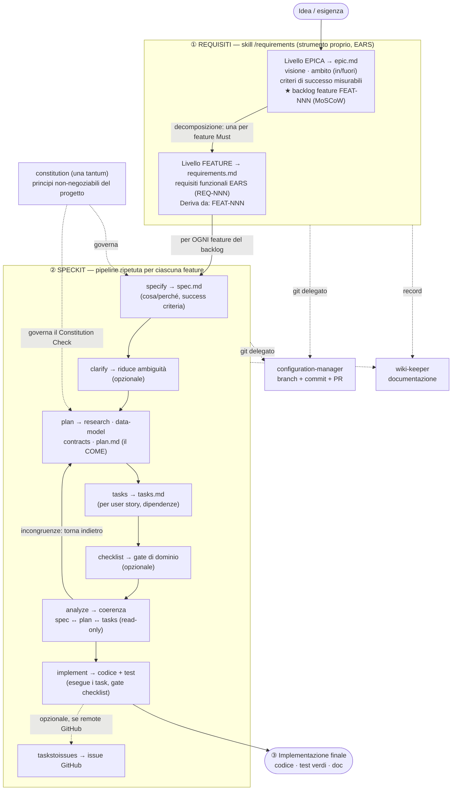

# Flusso end-to-end epica → implementazione

Questo documento descrive il flusso completo dall'idea iniziale (requisito di alto livello) all'implementazione finale, articolato su due strati disaccoppiati:
1. **Fase REQUISITI** — strumento proprio del workspace ([[requirements-engineering]]), basato su [[ears-methodology]]
2. **Pipeline SpecKit** — framework di governance ([[speckit]]) applicato a ogni feature

Il diagramma sottostante mostra il flusso integrale e le responsabilità trasversali (constitution, git, wiki).

## Diagramma di flusso

## Come leggerlo

### ① Requisiti (strumento proprio)

La fase REQUISITI avviene **a monte** e **indipendentemente** da SpecKit. Produce due artefatti:
- **epic.md** — contiene la visione, l'ambito (cosa è in/fuori scope) e criteri di successo misurabili. Decomplica il progetto in feature (FEAT-001, FEAT-002, ...) usando la tassonomia MoSCoW (Must/Should/Could/Won't).
- **requirements.md** — un file per ogni feature Must del backlog. Contiene requisiti funzionali espressi in formato [[ears-methodology]] (5+1 pattern atomici, testabili, tracciabili).

**Disaccoppiamento:** la skill `/requirements` è **agnostica** rispetto a design e governance a valle. Non conosce SpecKit; è solo formalizzazione del cosa.

### ② SpecKit (pipeline per feature)

Ogni feature del backlog attraversa la pipeline SpecKit **una sola volta**. Ogni fase produce un artefatto:

| Fase | Artefatto | Scopo |
|------|-----------|-------|
| **specify** | spec.md | Traduce il requisito in "cosa" cerchiamo e "perché" lo vogliamo, success criteria |
| **clarify** | clarify.md (opzionale) | Risolve ambiguità esplicite |
| **plan** | plan.md | Il "come" — ricerca, data-model, contract API, dipendenze |
| **tasks** | tasks.md | Scompone il plan in user story e task atomici con dipendenze |
| **checklist** | checklist.md (opzionale) | Gate di dominio (architetturale, security, performance, ...) |
| **analyze** | (report in console) | Verifica coerenza spec ↔ plan ↔ tasks; segnala incongruenze (read-only) |
| **implement** | codice + test + doc | Esegue i task, verifica i gate checklist, rispetta le success criteria |
| **taskstoissues** | GitHub issue (opzionale) | Sincronizza task.md verso issue tracker se remote |

**Flusso caratteristico:**
1. Entra in **specify** leggendo `requirements/<feature>/requirements.md`.
2. Naviga **plan** con accesso ai tool MCP (search_code, find_symbol, etc.) per studiare codebase.
3. **analyze** controlla la coerenza; se trovate incongruenze, torna indietro a **plan** per correggere.
4. Approva **implement** solo se gli artefatti spec ↔ plan ↔ tasks sono coerenti e i gate checklist passano.

### ③ Output finale

Dopo che TUTTI i task di una feature hanno passato la verifica in **implement**:
- Codice funzionante e testato
- Test suite verde (nuovi + regressione)
- Documentazione aggiornata
- Traccia di origine (feature → EARS → task → commit)

### Trasversali

#### Constitution (governance)
Una cartella progetto è creata con una `constitution.md` (una tantum). Raccoglie i principi non-negoziabili (architettura, lingua, convenzioni). Viene consultata in **specify** e **plan** per il Constitution Check (passare/fallire il gate).

#### Configuration-manager (git)
**Tutte** le operazioni git (branch, commit, merge, PR) sono **delegate** all'agente `configuration-manager` (mai eseguite direttamente). Ogni fase (REQ, SPEC, PLAN, IMPL) termina con un brief di commit. L'agente fa staging selettivo, messaggio Conventional Commits, e riporta hash e file inclusi.

#### Wiki-keeper (documentazione)
**Tutte** le attività rilevanti (fase completata, decisione, learning) sono delegate all'agente `wiki-keeper` per l'aggiornamento del wiki locale. Non bloccante; il flusso principale non aspetta.

### Disaccoppiamento cruciale

**Requisiti e SpecKit sono disaccoppiati.**
- La skill `/requirements` **non sa** dell'esistenza di SpecKit.
- SpecKit **non genera** requisiti; li legge da `requirements/<feature>/requirements.md`.
- L'aggancio fra i due è **esplicito e opzionale:** l'utente/orchestratore legge `requirements.md` e lo passa manualmente (o via shell) a `/speckit-specify`.

Questo disaccoppiamento permette:
1. Riuso di `/requirements` su progetti senza SpecKit.
2. Evoluzione indipendente dei due asset.
3. Sostituzione futura di SpecKit con altri framework senza toccare i requisiti.

## Riferimenti

- [[requirements-engineering]] — descrizione della fase REQUISITI, EARS, formato output.
- [[ears-methodology]] — approfondimento metodologia EARS (5+1 pattern).
- [[speckit]] — descrizione framework SpecKit, 9 fase canoniche, flow operativo, policy git.
- [[constitution]] — pattern per la governance progetti (se esiste).
