# Flussi delle operazioni wiki + analisi di modularizzazione del playbook

> **Scopo:** capire (a) **come scorre** ciascuna operazione del sistema-wiki — dove finisce il
> *meccanico* (CLI deterministica) e dove inizia il *giudizio* (LLM) — e (b) se conviene che il
> **playbook** faccia riferimento a delle *skill* invece di descrivere tutto in un unico file.
> È materiale di analisi per lo **step #3** (revisione `CLAUDE.md` + `wiki-playbook.md`). È *tooling*,
> non contenuto del wiki → sta qui, non in `wiki/`.

---

## Parte 1 — Com'è cablato oggi (la direzione reale)

Attenzione a un equivoco: **oggi non è il playbook a riferirsi alle skill, è l'inverso.** I tre
**wrapper host-specifici** (la skill `wiki-author`, il comando `/wiki`, l'agente `wiki-curator`) sono
sottili e **leggono un unico playbook** come *fonte di verità*. Il playbook a sua volta poggia sul
**nucleo deterministico** (`sertor-wiki-tools`) per il meccanico e legge `wiki.config.toml` per tutto
ciò che è specifico dell'ospite.

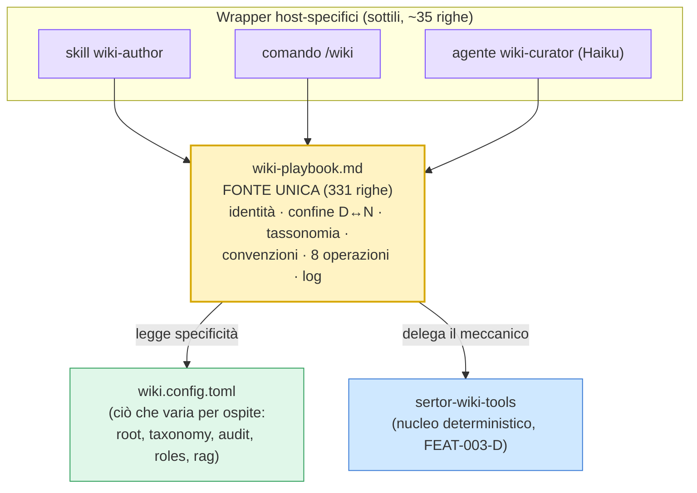

La proposta in discussione — *«il playbook fa riferimento a delle skill»* — ribalterebbe questo: il
playbook diventerebbe un indice magro e ogni operazione una skill a sé. La Parte 3 valuta se conviene.

---

## Parte 2 — Il flusso di ciascuna operazione

### Anatomia comune (tutte le operazioni hanno questo scheletro)

Ogni operazione è **input → passi → output**, dove i passi si dividono in due corsie e l'output è
sempre *pagine toccate + UNA voce di log*.

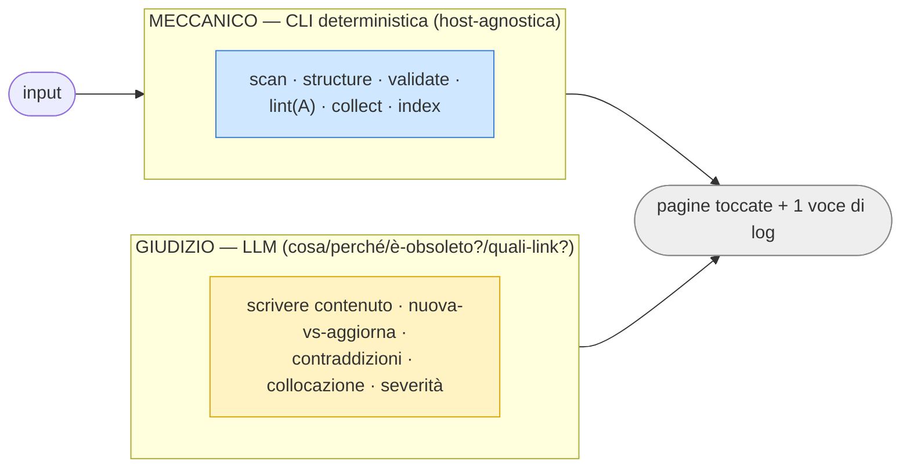

**Legenda corsie (vale per tutti i diagrammi sotto):**
🟦 **azzurro = meccanico** (CLI `sertor-wiki-tools`, deterministico) · 🟨 **giallo = giudizio** (LLM).
**Chi esegue:** le operazioni documentali (`record`, `ingest`, `query`, lint **A**) possono girare
anche col **curator (Haiku) in background**; lint **B/C**, `reorg`, `generate-from-diff`, `rag-sync`
richiedono il **flusso principale (Opus)** perché sono giudizio o costano/sono distruttive.

---

### `record` — registra lavoro/decisione svolti · *curator OK*

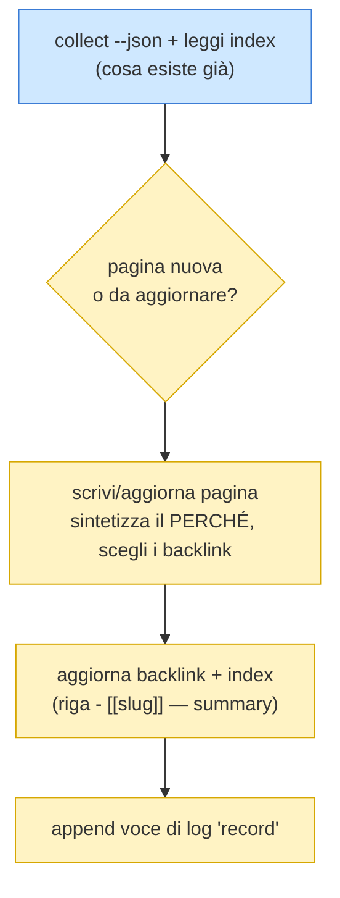

### `ingest` — acquisisci una fonte esterna · *curator OK*

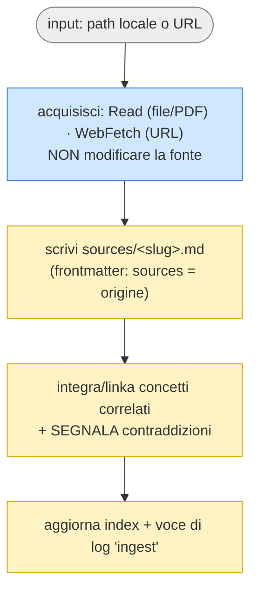

### `query` — rispondi a una domanda sul wiki · *curator OK*

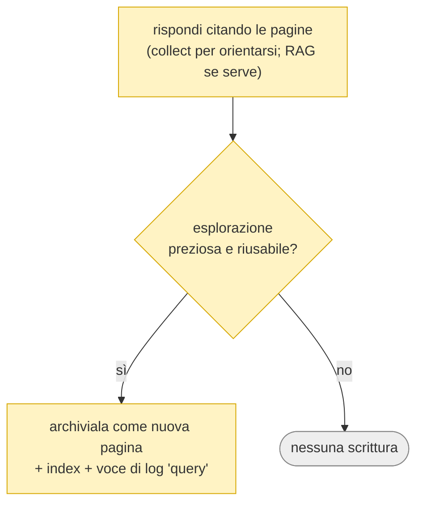

### `lint` — verifica di coerenza · *A: curator OK — B/C: solo flusso principale*

I **tre livelli** sono ortogonali. **A** è la baseline meccanica; **B** verifica *claim ↔ realtà del
repo*; **C** verifica *organizzazione* (collocazione/atomicità/link). Default: **report con severità,
nessun auto-fix**, correzione solo su conferma. L'**ambito** (cosa lintare) e il `kind` di ciascun
target vengono da `[[audit]]` in config.

```mermaid
flowchart TD
    START([lint sui target di '[[audit]]'])

    subgraph LA["A · STRUTTURALE (meccanico)"]
        a1["sertor-wiki-tools lint + validate --json<br/>→ wikilink rotti · orfani · frontmatter · naming"]:::cli
    end

    subgraph LB["B · SEMANTICO (giudizio — claim ↔ repo)"]
        b1["estrai claim verificabili<br/>(conteggi, stati, versioni, date, simboli)"]:::llm
        b2["ground truth:<br/>git→ruolo VCS · file/simboli→RAG o Read/Grep · conteggi→pytest"]:::cli
        b3["confronta → giudica deriva<br/>(applica profilo del kind)"]:::llm
        b1 --> b2 --> b3
    end

    subgraph LC["C · ORGANIZZATIVO (giudizio — solo kind=wiki)"]
        c1["collect + calcola backlink<br/>(invertendo i wikilink)"]:::cli
        c2["collocazione vs natura · type falso ·<br/>tassonomia collassata · atomicità · link"]:::llm
        c1 --> c2
    end

    START --> LA
    START --> LB
    START --> LC
    LA --> R["REPORT con severità (Alto/Medio/Basso)<br/>+ proposta per finding"]:::out
    LB --> R
    LC --> R
    R --> FIX{"correggi su conferma?"}:::llm
    FIX -->|claim| FX1["aggiorna SOLO pagine attive<br/>(mai il log storico)"]:::llm
    FIX -->|organizzazione| FX2["→ operazione reorg"]:::llm

    classDef cli fill:#cfe8ff,stroke:#3a7bd5;
    classDef llm fill:#fff3c4,stroke:#d6a700;
    classDef out fill:#eee,stroke:#888;
```

> **Al commit** gira **A** (su `wiki`) **+ B incrementale solo sul changeset** → warning **non
> bloccante** (mai blocco, mai auto-fix). B al commit è giudizio LLM → dipende dal trigger (oggi non
> cablato: il warning ricorda di lanciare `/wiki lint` sul changeset). Questo è il nodo aperto **FR-004**.

### `reorg` — applica il refactoring organizzativo · *solo flusso principale*

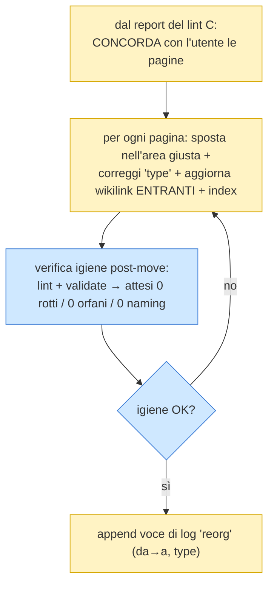

> Più distruttivo (sposta file, riscrive link) → **mai automatico, un incremento per volta**. NON al curator.

### `generate-from-diff` — aggiorna dalle modifiche recenti · *solo flusso principale*

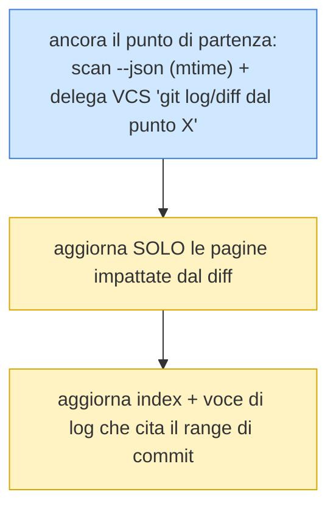

### `rag-sync` — re-indicizza il wiki nel RAG · *solo flusso principale*

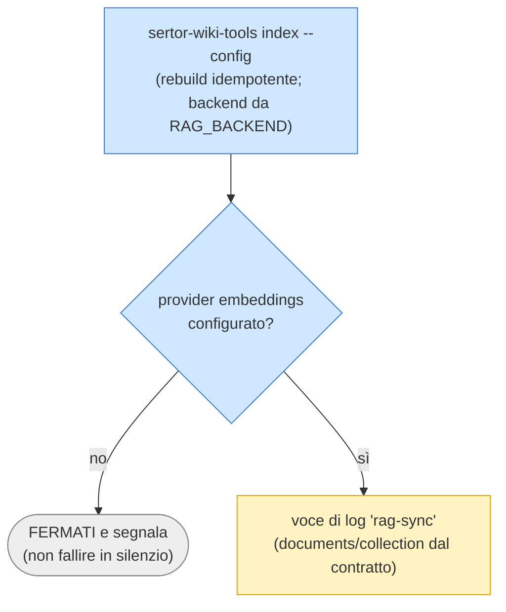

> **Costo:** con backend `azure` gli embeddings sono a pagamento → ruolo "corpus" di DA-W1.

### `structure` — bootstrap della struttura · *puro meccanico*

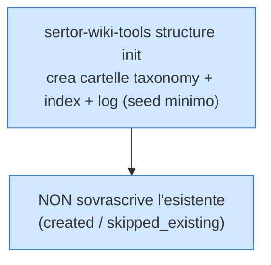

> Nessun giudizio: l'unica operazione 100% meccanica, senza corsia gialla.

### Sintesi: il peso meccanico/giudizio per operazione

| Operazione | Meccanico (CLI) | Giudizio (LLM) | Esecutore |
|---|---|---|---|
| `structure` | ●●● | — | curator/CLI |
| `record` | ● (collect) | ●●● | curator OK |
| `ingest` | ● (acquire) | ●●● | curator OK |
| `query` | ● (collect/RAG) | ●●● | curator OK |
| `lint A` | ●●● | — | curator OK |
| `lint B` | ● (ground truth) | ●●● | **solo Opus** |
| `lint C` | ● (collect+backlink) | ●●● | **solo Opus** |
| `reorg` | ● (verifica igiene) | ●●● | **solo Opus** |
| `generate-from-diff` | ●● (scan+git) | ●● | **solo Opus** |
| `rag-sync` | ●●● | ○ (solo log) | **solo Opus** |

Lettura: **il meccanico è già tutto fattorizzato nella CLI**; ciò che resta nel playbook è quasi
ovunque **giudizio condiviso** (tassonomia, convenzioni, confine D↔N, contraddizioni). È il dato che
pesa sulla scelta della Parte 3.

---

## Parte 3 — Playbook unico vs riferimento a skill

### Le tre opzioni in campo

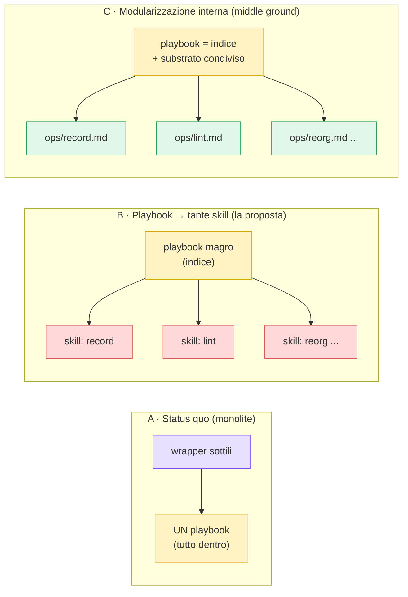

- **A — Status quo:** un playbook monolitico; i wrapper lo leggono interamente.
- **B — Playbook → skill:** una *skill di Claude Code* per operazione; il playbook si riduce a indice.
- **C — Modularizzazione interna:** il playbook si spezza in un **indice + file `.md` per operazione**
  caricati on-demand dal wrapper. Restano documenti portabili, **non** meccanismi dell'host.

### Tabella comparativa

| Criterio | A · Monolite (oggi) | B · Tante skill | C · Moduli `.md` interni |
|---|---|---|---|
| **Economia di contesto** (progressive disclosure) | ✗ carica 331 righe per *qualsiasi* op | ✓ carica solo l'op invocata | ✓ carica indice + il modulo dell'op |
| **Substrato condiviso** (tassonomia, confine D↔N, convenzioni, log) | ✓ in un punto solo, DRY | ✗ va duplicato in ogni skill **o** ri-centralizzato (= ricrei il monolite come base) | ✓ resta nell'indice, condiviso |
| **Host-agnosticità (Principio X)** | ✓ `.md` portabile, zero coupling | ✗ le *skill* sono un costrutto **dell'host** → accoppi il sistema-wiki a Claude Code | ✓ `.md` config-driven, zero coupling |
| **Discoverability** | ○ una skill/comando ombrello | ✓ `/wiki-record`, `/wiki-lint` di primo livello | ○ come A (un wrapper) |
| **Manutenzione / deriva** | ✓ un file da tenere allineato | ✗ N file + duplicazione → nuova superficie di deriva (proprio ciò che il lint combatte) | ○ N file ma senza duplicazione del substrato |
| **Coesione** (le op condividono un modello) | ✓ massima | ✗ frammenta varianti dello stesso modello | ✓ alta (substrato esplicito) |
| **Costo del cambiamento** | — (è lo stato attuale) | ●●● riscrittura + ridisegno dei wrapper | ●● split del solo playbook |

### Perché B (skill) **non** conviene a questo sistema

1. **Le operazioni non sono tool indipendenti: sono varianti di un modello condiviso.** Dalla Parte 2:
   `record`/`lint`/`reorg` usano *tutte* tassonomia + convenzioni + confine D↔N. Spezzarle in skill
   obbliga a **duplicare** quel substrato (violazione DRY, e la deriva *tra file di governance* è
   esattamente ciò che il lint semantico esiste per combattere) **oppure** a ri-centralizzarlo in un
   file comune — che è il playbook di oggi. Reintroduci il monolite come base e in più paghi la
   frammentazione.

2. **Principio X — è il motivo dirimente.** Le *skill* sono un costrutto **dell'host** (Claude Code).
   Il playbook è governance **portabile**, letta dal layer agentico di *qualunque* host. Codificare le
   operazioni come skill accoppia il sistema-wiki a un host specifico — proprio l'accoppiamento che il
   Principio X (NON-NEGOZIABILE) vieta. Il pattern giusto è *core portabile (playbook `.md`
   config-driven) + wrapper sottile host-specifico* — quello che c'è già.

### La buona idea dentro la domanda → opzione C

Il beneficio reale che la proposta insegue è la **progressive disclosure**: oggi invocare `record`
carica anche le ~85 righe di `lint` B/C, che è il blocco più pesante e crescerà. Lo si ottiene **senza**
le skill, **spezzando il playbook stesso** in indice + `ops/*.md` per operazione, caricati on-demand.
Resta portabile (sono `.md`), DRY (substrato nell'indice), e non viola il Principio X. È la differenza
tra **modularizzare un documento** (buono, portabile) e **spostare logica nel meccanismo-skill
dell'host** (rompe la portabilità).

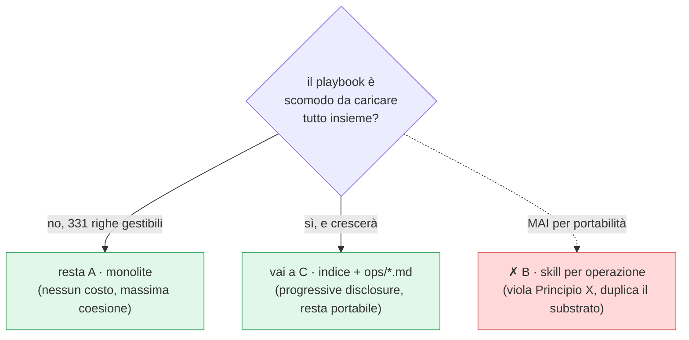

### Raccomandazione

- **No alla proposta B** (playbook → skill): rompe l'host-agnosticità e duplica il substrato condiviso.
- **A oggi è adeguata** (331 righe sono gestibili); la coesione vale più della micro-economia di contesto.
- **C è la mossa giusta *se e quando* il playbook diventa scomodo** — ed è la forma concreta che
  prenderebbe lo **step #3** se decidessimo di modularizzare. Trigger naturale: quando `lint` B/C (o un
  nuovo blocco) rende il file sproporzionato rispetto a ciò che serve per la singola operazione.
