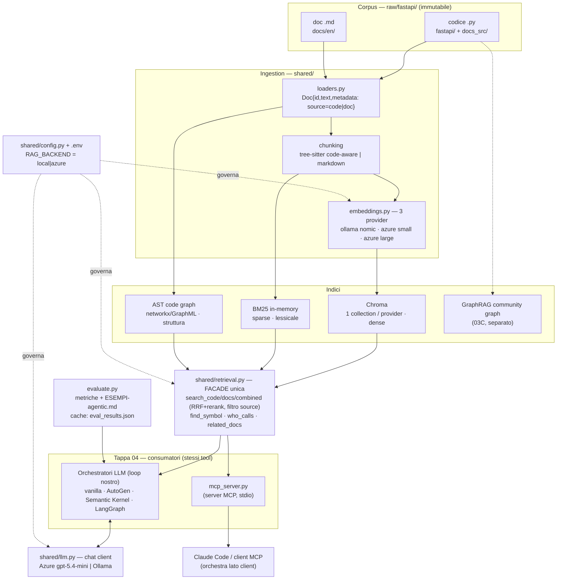

# Architettura attuale (as-built)

Stato del workspace al 2026-05-29: tappe **01–04 complete**. Questo è il disegno **realizzato**
(complementare al disegno *target* in [[architettura-target]]). Principio portante: gli **stessi
tool** di `shared/retrieval.py` alimentano sia 4 orchestratori LLM sia il server MCP, senza
duplicazione.

## Diagramma

## Strati

1. **Ingestion → Indici.** `loaders.py` produce `Doc` con `source=code|doc`; il chunking è
   code-aware (tree-sitter) per il codice, markdown per i doc; `embeddings.py` offre 3 provider.
   Tre indici complementari: denso (**Chroma**), lessicale (**BM25**), strutturale (**grafo AST**).
   **GraphRAG** (03C) è un indice a community separato.
2. **Facade.** `shared/retrieval.py` è l'**unico** punto d'accesso ai motori, con 6 tool
   (`search_code/docs/combined` con RRF + rerank FlashRank e filtro `source`; `find_symbol`,
   `who_calls`, `related_docs` sul grafo). Nasconde i dettagli delle tappe 01–03.
3. **Consumatori (Tappa 04).** Gli stessi 6 tool alimentano: (a) 4 **orchestratori LLM** con loop
   proprio (`vanilla`, AutoGen, Semantic Kernel, LangGraph) via `shared/llm.py`; (b) il **server
   MCP** (`mcp_server.py`), dove l'orchestrazione la fa il client (**Claude Code**). `evaluate.py`
   pilota gli orchestratori e genera metriche + `ESEMPI-agentic.md`.
4. **Trasversale.** `config.py`/`.env` (`RAG_BACKEND`) governa provider di embedding e LLM:
   switch local↔azure. Entry point operativo attuale: **Azure gpt-5.4-mini** + text-embedding-3-large
   (vedi [[agent-llm-azure-non-locale]]).

## Caching — stato e backlog di produzione

**In cache oggi:** risultati eval (`eval_results.json` + `--render-from` + merge per-motore);
indici in-process (`@lru_cache` su HybridIndex/CodeGraph in `shared/retrieval.py`, caldi nel
processo long-lived del server MCP); modello FlashRank su disco; cache estrazione GraphRAG (~210 MB).

**Backlog di produzione** (non in prototipo — vedi policy SpecKit/branch in [[git-policy-prototipo-vs-produzione]]):
1. **Cache embedding query** (lru/disk in `shared/embeddings.py`) — evita di ri-embeddare (e ri-pagare in azure) query identiche.
2. **Cache risposte LLM su disco** (es. SQLite) — run agent/eval riproducibili e gratuiti sui task già visti.
3. **Tracciare/ottimizzare il prompt-caching di Azure** (`cached_tokens` in `shared/llm.py`) — misurare l'hit-rate e ordinare i prompt (system + schemi tool in testa) per massimizzarlo.

Altri punti di produzione: igiene corpus (blob base64 in `docs_src/`), eval con task multi-hop
più discriminanti + media multi-run, transizione a **SpecKit + branch/PR**.
