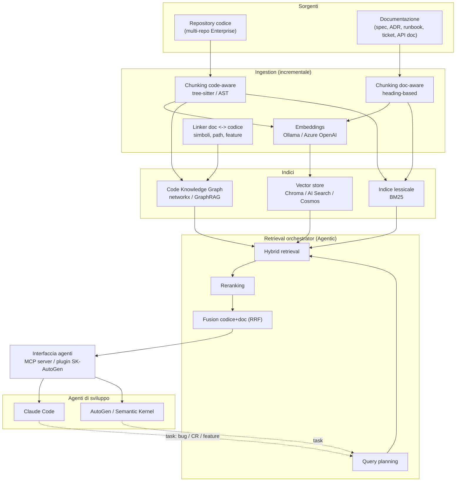

# Architettura target — dual-RAG per codice + documentazione

## Obiettivo

Un sistema di retrieval che fornisce agli **agenti di sviluppo** (Claude Code, AutoGen,
Semantic Kernel) contesto **combinato** da due basi di conoscenza:

1. **Code RAG** — il codice sorgente di applicativi Enterprise (multi-repo).
2. **Docs RAG** — la documentazione (spec funzionali, design/ADR, runbook, ticket/CR, API doc).

Quando un agente lavora su un **bug**, una **CR/change** o una **nuova funzionalità**,
interroga automaticamente **entrambi** i RAG e riceve un contesto fuso codice+doc. È il
punto di arrivo; ci si arriva per tappe (vedi [Roadmap](#roadmap-incrementale-01--04)).

## Principi di design

- **Code-aware ≠ text-aware**: il codice va spezzato per unità sintattiche (funzioni, classi,
  metodi) via **AST/tree-sitter**, non a finestre fisse; preservare firme, docstring, import.
- **Hybrid quasi obbligatorio sul codice**: servono sia match **lessicali** esatti su
  identificatori/simboli (BM25) sia **semantici** (embeddings). Vedi [[hybrid-search]].
- **Il codice è un grafo**: simboli, call graph, import, ereditarietà → naturale per
  **GraphRAG**; abilita query multi-hop ("chi chiama X?", "quali doc descrivono il modulo Y?").
- **Fusione codice ↔ doc**: un layer di linking collega documenti e simboli/file; il
  retrieval interroga i due corpora e **fonde** i risultati (RRF + rerank).
- **Local-first, Azure opzionale**: codice Enterprise è sensibile → default locale
  (Ollama/Chroma); scalabilità su Azure con endpoint privati. Switch via `RAG_BACKEND`.
- **Indicizzazione incrementale**: repo grandi → re-index solo sui cambiamenti (git/CI).
- **Valutabile**: ogni tappa misurata su un set di query→file/simboli attesi (recall@k, MRR).

## Componenti

| Layer | Locale | Azure |
|-------|--------|-------|
| Ingestion codice | tree-sitter/AST chunker | idem |
| Ingestion doc | loader markdown/PDF/Confluence + chunking per heading | idem |
| Embeddings | Ollama (`nomic-embed-text`) | Azure OpenAI (`text-embedding-3-*`) |
| Vector store | Chroma | Azure AI Search / Cosmos DB for NoSQL |
| Indice lessicale | BM25 (rank_bm25 / FlashRank) | Azure AI Search (hybrid integrato) |
| Code graph | networkx | Microsoft GraphRAG |
| Reranking | cross-encoder (`sentence-transformers`) | Azure AI Search semantic ranker |
| Orchestrazione | LangChain | Semantic Kernel / AutoGen |
| Interfaccia agenti | **MCP server** + plugin SK/AutoGen | idem |

Vedi anche [[stack]] per la mappa completa.

## Diagramma

## Consumo da parte degli agenti

**Decisione (adattabile):** il retrieval è esposto come **MCP server** (tool riutilizzabili),
così è consumabile **nativamente da Claude Code** e, con un adattatore sottile, anche da
agenti **AutoGen/Semantic Kernel**. Stesso backend, più frontend → non dobbiamo scegliere
ora tra "Claude Code via MCP" e "sistema AutoGen separato": li abilitiamo entrambi.

Tool MCP previsti (bozza): `search_code`, `search_docs`, `search_combined`,
`get_symbol_graph`, `who_calls`, `find_related_docs`.

## Roadmap incrementale (01 → 04)

| Tappa | Cartella | Cosa aggiunge | Obiettivo dimostrabile |
|-------|----------|---------------|------------------------|
| 0 | `shared/` | config (`RAG_BACKEND`), loaders, dataset di prova (1 repo + sue doc), eval harness | base comune + metrica recall@k |
| 1 | `01-baseline/` | Code RAG e Docs RAG **separati**: chunking code-aware, embeddings, Chroma, similarity search | query → chunk rilevanti su ciascun corpus |
| 2 | `02-hybrid-reranking/` | Hybrid (BM25+dense) + reranking; **prima fusione** dei due corpora (RRF) | recall/precision migliori; un solo bundle codice+doc |
| 3 | `03-graphrag/` | **Code knowledge graph** (simboli, call graph, import) + link doc↔codice con Microsoft GraphRAG | query multi-hop ("chi chiama X", "doc del modulo Y") |
| 4 | `04-agentic-rag/` | **Orchestrator** (query planning, retrieval iterativo) esposto via **MCP**; gli agenti lo usano in automatico su bug/CR/feature | obiettivo finale: agente che legge da solo codice+doc |

Dettaglio per tappa:

- **Tappa 0 — Fondamenta.** Scegliere un repo campione + la sua documentazione. Costruire
  `shared/`: caricatori, config provider/backend, e un piccolo set di valutazione
  (coppie query→file/simbolo attesi) per misurare ogni miglioramento successivo.
- **01 Baseline.** Provare end-to-end il retrieval su codice e doc, separatamente. Validare
  il chunking code-aware (tree-sitter) vs naive. Vedi [[rag-overview]].
- **02 Hybrid + reranking.** Introdurre BM25 (cruciale per identificatori) + dense + rerank.
  Implementare la **fusione** dei due retriever (Reciprocal Rank Fusion) → primo contesto
  combinato. Variante Azure: Azure AI Search hybrid + semantic ranker.
- **03 GraphRAG.** Estrarre il grafo del codice e i collegamenti doc↔codice; abilitare il
  retrieval multi-hop e la sintesi "globale" su moduli/feature.
- **04 Agentic RAG.** Loop di retrieval iterativo con query planning (AutoGen/SK), impacchettato
  come server MCP. Da qui Claude Code e gli altri agenti ottengono **automaticamente** il
  contesto codice+doc quando sviluppano, fixano bug o gestiscono CR.

## Concerns trasversali

- **Valutazione**: mantenere e far crescere l'eval set; confrontare le tappe.
- **Incrementalità**: re-index su diff (git hook / CI), non full rebuild.
- **Sicurezza/privacy**: codice sensibile → locale in dev, Azure con private endpoint in scala.
- **Access control** (futuro): rispettare i permessi di repo/doc nelle risposte.
- **Multi-repo & multi-linguaggio**: metadati per repo/lingua/modulo; tree-sitter copre molti linguaggi.

## Decisioni prese (2026-05-28)

- **Repo/doc campione: [`fastapi/fastapi`](https://github.com/fastapi/fastapi)** (MIT, branch `master`).
  Scope: codice = `fastapi/` (48 file `.py`), documentazione = `docs/en/` (153 file Markdown),
  link doc↔codice = `docs_src/` (454 esempi `.py` citati dai doc). Traduzioni `docs/<lingua>/` escluse.
  Motivo: codice Python pulito e tractabile, doc ricca **separata** in Markdown, e `docs_src/`
  fornisce relazioni doc↔codice esplicite — ideale per dimostrare la fusione.
- **Layer agenti: MCP-first** — prima Claude Code via MCP; adattatore AutoGen/SK in tappa successiva.
- **Embedding: confronto multi-provider fin da subito**, su stesso eval set, tramite layer
  intercambiabile via config. **Tutti e 3 verificati live** (`shared/check_embeddings.py`):
  - `nomic-embed-text` locale (Ollama) — **768 dim** ✓
  - Azure AI Foundry (Azure OpenAI) `text-embedding-3-small` — **1536 dim** ✓
  - Azure AI Foundry (Azure OpenAI) `text-embedding-3-large` — **3072 dim** ✓
  - Azure usa l'**endpoint v1** (`.../openai/v1`) con header `api-key`; route `/embeddings`,
    body `{"model": <deployment>, "input": ...}`.
- **Vector store: Chroma in locale** per Tappa 0/1; confronto Azure AI Search vs Cosmos DB for NoSQL dopo.
- **Ambiente Python: venv `uv` con Python 3.12** (il Python di sistema è 3.14, troppo recente
  per i wheel di chromadb/langchain).
- **Corpus campione materializzato**: sparse+shallow clone in `raw/fastapi/` (vedi [[fastapi]]).

## Decisioni ancora aperte

- Granularità del chunking del codice (per funzione vs per classe/file) — da tarare in Tappa 1.
