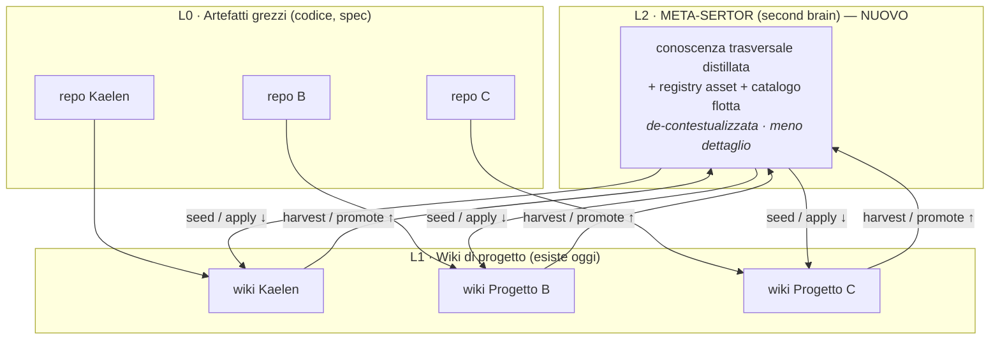
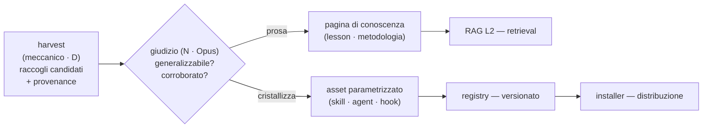
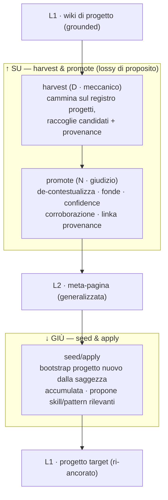
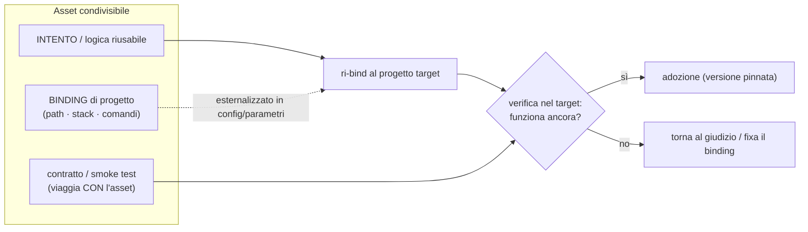
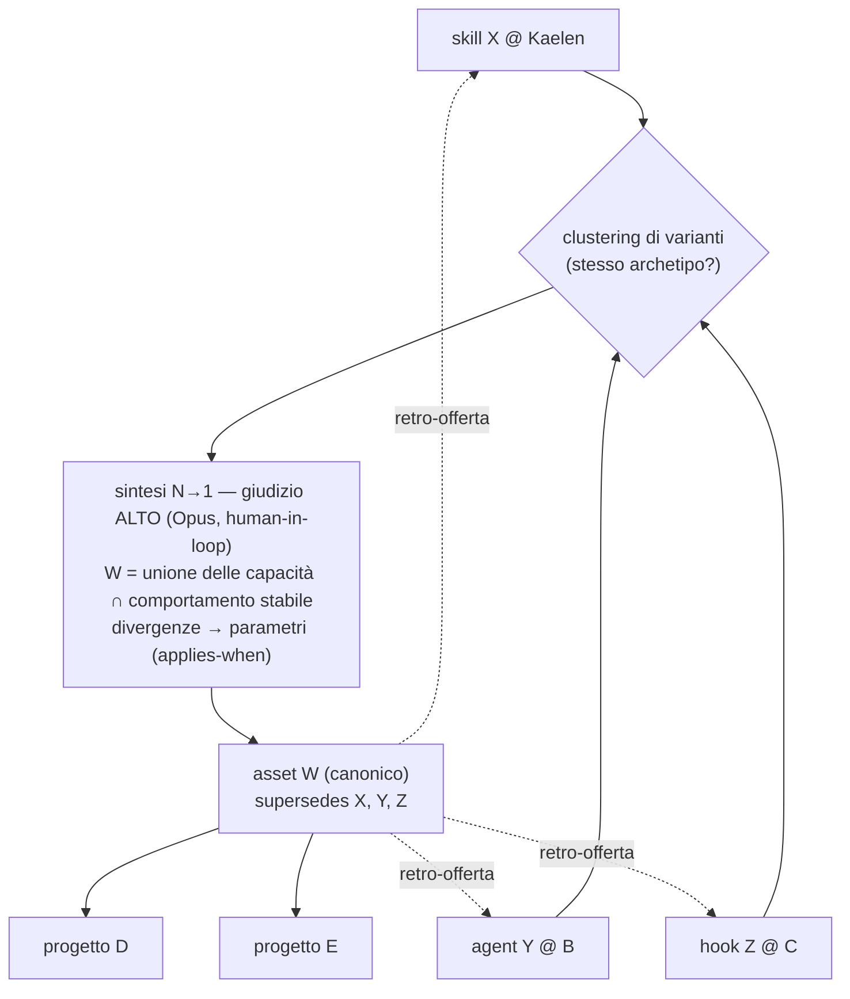
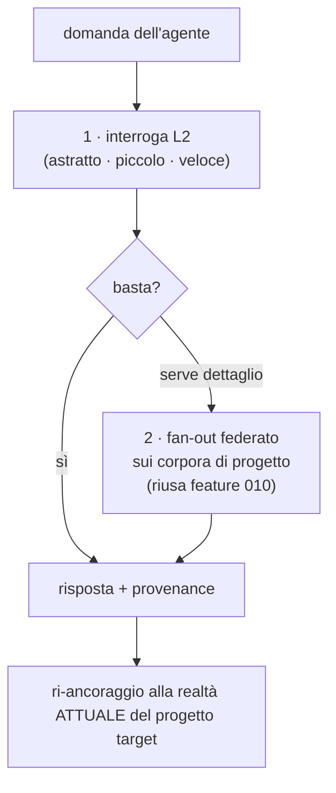

# Second brain cross-progetto — il «Sertor dei Sertor»

> **Stato: 💡 IDEA da espandere.** Pagina di visione/architettura, frutto del ragionamento del
> 2026-06-13. **Non** è codice né una feature in pipeline: cattura la tesi, i diagrammi, le decisioni
> aperte e i rischi, così quando l'idea matura si parte da qui (→ backlog epica → `/requirements` →
> SpecKit). Nessuna riga di `src/` la implementa oggi.

## Il problema

Con la rivoluzione agentica, una persona sola o un piccolo team lavorano su **molti progetti diversi in
parallelo**. Ogni progetto, grazie a Sertor, accumula la propria conoscenza (wiki) e i propri **asset**
(skill, agent, hook, playbook, template). Ma quella conoscenza e quegli asset restano **prigionieri del
singolo contesto**: una lesson imparata su Kaelen non aiuta il progetto B; una skill nata su Kaelen va
riscritta a mano per riusarla altrove; non esiste un luogo dove le esperienze di N progetti si
**fondano** in qualcosa di più alto.

Serve un livello sopra i singoli Sertor: una **conoscenza condivisa e di più alto livello (meno
dettagliata)** di tutto il proprio contesto di lavoro. Alcuni la chiamano *second brain*. Il nome
definitivo è aperto (vedi sotto); qui lo chiamo **Meta-Sertor**.

Lo scopo: **condividere esperienze e metodologie tra contesti diversi, scambiarsi skill/agenti,
informazioni e lesson learned**, e — più ambizioso — **unire esperienze/tool di più progetti per
sintetizzare un asset nuovo** usato da altri progetti ancora.

---

## Tesi centrale: è un Sertor ricorsivo

Non è un secondo sistema: è **Sertor applicato a se stesso, un'altitudine più su**. Oggi, dentro un
progetto, il wiki ha già due memorie (vedi [[diary-vs-graph]]): il **diario** (log + record datati,
*"cosa è successo"*, memoria episodica) e il **grafo** (pagine-entità evergreen, *"cosa è vero adesso"*,
memoria semantica). Il second brain è un **terzo strato di altitudine**.

- **L0** = artefatti grezzi del progetto (codice, spec) — grounded, dettagliatissimi.
- **L1** = wiki di progetto (conoscenza distillata di *un* contesto) — **esiste già**.
- **L2** = Meta-Sertor (conoscenza distillata **trasversale**) — il nuovo.

Tecnicamente, **L2 è un'istanza di `sertor-core` il cui corpus è l'output distillato dei Sertor di
progetto**. Il motore esiste; il nuovo non è il motore, è il **confine di promozione** tra L1 e L2.

**Analogia cognitiva (bussola):** è il consolidamento **ippocampo → neocorteccia**. L'esperienza
episodica (dettagliata, per-progetto) si consolida in conoscenza semantica astratta e de-contestualizzata.
Il second brain è la neocorteccia delle neocortecce.

---

## Lo spostamento di prodotto: Sertor da autore a giardiniere

Oggi Sertor è **l'autore** degli asset e i progetti sono **consumatori** (modello installer: una
sorgente canonica → host; vedi [[sertor-installer]]). La visione **capovolge** questo:

> **I progetti non sono solo consumatori: ne sono i produttori.** Kaelen genera una sua skill; un altro
> progetto un'altra; il Meta-Sertor le raccoglie, le generalizza e le ridistribuisce. Sertor diventa il
> **substrato/marketplace** di un ecosistema auto-migliorante. Le skill di Sertor (wiki-author,
> wiki-curator…) sono solo l'**inventario-seme**: il bootstrap del registry, non la sua fonte
> autoritativa.

Il flusso degli asset diventa **molti-a-molti**: `A → meta → B,C` (trasporto) e
`A+B+C → meta → asset nuovo W → D,E` (sintesi). È **federated learning di tooling**: la flotta evolve, il
Meta-Sertor consolida. Sertor passa da **autore** a **giardiniere della flotta**.

**Conseguenza diretta sul disegno (l'installer si inverte):** oggi l'installer assume **un autore
canonico** (package-data = fonte, `.claude/` = derivato, guard test che li tengono in sync). Il modello-
flotta ha **molti autori** → la fonte di verità diventa il **registry**, e la package-data di Sertor
scende a *seme*. L'installer resta il **canale di distribuzione** (`sertor install <asset-dal-registry>`,
versioni pinnate, propagazione update tipo *dependabot-per-skill*), ma la direzione si capovolge:
non più *canonico → host*, bensì **host → registry → host**.

---

## Conoscenza e asset: la stessa sostanza, diversi gradi di cristallizzazione

Errore da evitare: trattare "conoscenza" e "asset" come due mondi separati. Lifecycle diverso, **stessa
materia**:

> Una **lesson learned** ("quando fai X, fai Y") è conoscenza *liquida*. Una **skill** che codifica "fai Y
> quando X" è la stessa conoscenza *cristallizzata* in forma eseguibile. Sono due stati della stessa cosa
> — come [[diary-vs-graph|diario vs grafo]], ma sull'asse del *fare* invece che del *sapere*.

Quindi: **condividono la stessa pipeline** (`harvest → giudizio → promote → distribuisci`) e lo stesso
modello di provenance/trust. Differiscono nell'**output** e in due requisiti extra dell'asset.

Il momento più interessante è la freccia **"cristallizza"**: il punto in cui una lesson ricorrente
(*"l'ho imparata su 3 progetti"*) smette di essere una pagina e **diventa un asset**. È il cerchio che si
chiude tra i due stati.

Questo **rettifica** una semplificazione iniziale ("tre concern separati, non mescolarli"): il *lifecycle*
è diverso, l'*ortogonalità* no. La pipeline è condivisa; cambia la forma dell'output.

### I due flussi (su / giù)

- **↑ Su — harvest & promote:** si divide come il confine [[deterministic-vs-judgment|D↔N]] già in uso.
  `harvest` è **meccanico** (raccogli candidati dai wiki: voci di log marcate come decisioni/lesson,
  pagine `concepts/`, postmortem, con provenance). `promote` è **giudizio** (decide *se* generalizzare,
  **de-contestualizza** — toglie il dettaglio di progetto, tiene il principio —, fonde, assegna
  confidence/corroborazione). È il `scan`(D)/`distill`(N) un'altitudine più su.
- **↓ Giù — seed & apply:** quando apri un progetto nuovo, L2 **semina** il wiki e propone skill/pattern
  rilevanti. È il `generate --da-zero`, ma alimentato dalla saggezza accumulata.

---

## Gli asset: due strati, verifica, sicurezza

L'asset ha **due cose in più** che la conoscenza non ha.

### 1. Estrazione del binding (parametrizzazione)

Un asset ha due strati: l'**intento/logica riusabile** e il **binding specifico del progetto** (path,
stack, comandi, vocabolario di dominio). **Riusare = estrarre l'intento, ri-legarlo** al progetto nuovo.

**Ricorsione bella:** questa è **esattamente la metodologia che Sertor ha applicato a se stesso** per
diventare host-agnostico (config esternalizzata `wiki.config.toml`, marker, package-data canonico +
`.claude/` derivato, guard test — [[sertor-installer]], **Principio X**). *Hai già risolto "rendere un
asset portabile tra host" — sui tuoi.* Il Meta-Sertor **generalizza quella metodologia** e la applica
agli asset di chiunque. Corollario operativo: **il primo asset che il sistema dovrebbe codificare è il
proprio playbook di de-contestualizzazione** — la prima skill è "come rendere una skill portabile",
imparata da come Sertor ha reso portabile se stesso.

**Gradiente di portabilità** (lo sforzo di *lift* scala con esso):

| Asset | Portabilità | Attenzione |
|---|---|---|
| prosa / metodologia (playbook, prompt) | quasi gratis | basta de-contestualizzare le parole |
| skill / agent | alta | assunzioni di progetto incorporate |
| hook / script | bassa | accoppiato all'ambiente (OS, path, convenzioni) |

### 2. Verifica — il rischio ingegneristico n°1

La conoscenza over-generalizzata è solo **vaga**; un asset over-generalizzato è **rotto**. Knowledge
degrada con grazia, il codice si spacca. Quindi un asset deve **viaggiare con il proprio contratto/smoke
test**, e il Meta-Sertor deve poterlo **eseguire nel target**. È l'equivalente-flotta dei guard test
(`test_host_agnostic`, `test_assets_sync`), ma quei test oggi vivono *dentro* Sertor: per un asset di
flotta il test è **parte dell'asset**. Senza, costruisci un marketplace di skill probabilmente-rotte.

### 3. Sicurezza / supply-chain

Un asset è **codice che eseguirà in un altro progetto** (gli hook soprattutto). La conoscenza è **inerte**;
l'asset è **attivo**. Prendere un agente/hook da Kaelen e lanciarlo altrove è **superficie di
supply-chain** → serve un gate di review/approvazione (firma, sandbox, o almeno conferma umana esplicita)
prima che un asset attraversi il confine di un progetto. Questo **affila il fork solo/team** (vedi sotto).

---

## La sintesi N→1 (la parte più ambiziosa)

"Unire esperienze/tool di più progetti per creare un asset usato da altri ancora" è **rilevamento di
evoluzione convergente**.

1. **Clustering di varianti** — accorgersi che il "deploy-checker" di Kaelen e il "ci-validator" di B sono
   lo stesso **archetipo** (similarità semantica sullo *scopo*, non sul testo → RAG + giudizio).
2. **Sintesi** — autorare W: **unione** delle capacità, **intersezione** del comportamento stabile,
   **parametrizzando** le divergenze.
3. **Lineage** — `W supersedes {X@Kaelen, Y@B, Z@C}`; offerto a D,E e retro-offerto ad A,B,C.

**Due avvertenze oneste:**
- **Non si auto-merge.** Tre skill non si fondono come un 3-way merge di testo: è *authoring* informato da
  tre priori. È l'operazione a **giudizio più alto e determinismo più basso** dell'intero sistema —
  costosa (Opus), **human-in-the-loop**. Da non vendere come automatica.
- Quando due varianti hanno fatto scelte **opposte per buone ragioni**, la sintesi **non sceglie un
  vincitore: parametrizza la scelta**. Questo `applies-when` ("strategia X se vale il vincolo C, altrimenti
  Y") è una **relazione tipata tra asset** → il **meta-grafo arriva prima sul lato asset che sul lato
  conoscenza** (vedi nota sul grafo sotto).

---

## La tensione da risolvere a monte (la più importante)

Tutto Sertor ha un'**ESSENZA**: *contesto dell'agente sempre reale, grounded*. Un second brain, per
definizione, **si allontana dalla ground truth** — astrae. L2 è quindi in tensione filosofica diretta col
principio fondante: più astrai, più è difficile restare grounded.

La riconciliazione — il singolo punto da cui dipende se la cosa è utile o diventa un *oracolo stantio*:

> **La meta-conoscenza non è mai autoritativa da sola.** È un'ipotesi/puntatore che porta **sempre la
> provenance** verso le pagine grounded di progetto (L1). Ogni applicazione si **ri-ancora alla realtà
> *attuale*** del progetto target. Il Meta-Sertor **propone**; il corpus di progetto **dispone**.

Concretamente: ogni meta-claim conserva i link a L1 da cui è stato distillato; una lesson applicata a un
progetto nuovo va **ri-validata** contro la sua ground truth. La provenance è l'antidoto.

### Query federata con escalation

Il retrieval rispetta la stessa logica: **prima L2** (astratto, piccolo, veloce: *"cosa so in
generale?"*), poi **escala** in fan-out sui corpora dei singoli progetti (*"dove esattamente l'ho
fatto?"*). È un comportamento agentic-RAG (router/escalation), coerente con come è chiusa FEAT-006.

La primitiva di fan-out **esiste già**: la **feature 010** (query congiunta multi-collezione,
`SERTOR_EXTRA_CORPORA`, fail-fast su provider eterogenei — vedi
[[spec-010-query-congiunta-e-upsert-index]]).

---

## Funzionalità (in ordine di valore/sforzo)

| # | Funzionalità | Cosa fa | Sforzo |
|---|---|---|---|
| 1 | **Catalogo / meta-roadmap** | executive summary trasversale: cosa è in progress dove, bloccato, shippato. La [[roadmap]] un'altitudine su, auto-assemblata dai blocchi `EXEC` di ogni progetto | **bassissimo** (candidato 1° deliverable) |
| 2 | **Query federata + escalation** | "l'ho già risolto, da qualche parte?" — riusa feature 010 | basso (quasi solo wiring) |
| 3 | **Harvest & promote** | la vera distillazione cross-progetto: il second brain | medio-alto (giudizio) |
| 4 | **Seed & apply** | bootstrap di un progetto nuovo dalla saggezza accumulata | medio |
| 5 | **Asset registry** | catalogo versionato di skill/agent/hook/template con provenance, "dove è usato", propagazione update | medio (package-management) |
| 6 | **Cross-project lint / drift** | una lesson regge ancora? quali progetti divergono da una metodologia standard? Il lint semantico a livello di **flotta** | medio |
| 7 | **Codifica di metodologie** | il loop: pattern ricorrente su N progetti → propone una skill nuova (chiude il cerchio conoscenza↔asset) | alto |

---

## Cosa si riusa, cosa è davvero nuovo

**Riusato (quasi tutto):**
- **Motore L2** = istanza `sertor-core` su corpus meta (pagine markdown distillate, `doc_type=doc`):
  chunker markdown, embeddings, vector store, motore [[hybrid-retrieval|ibrido]] — tutto esistente.
- **Query federata** = feature 010 ([[spec-010-query-congiunta-e-upsert-index]]).
- **Trigger di harvest** = il gruppo D di FEAT-007 (trigger periodico delegato allo scheduler ospite).
- **Asset come pacchetti** = le skill sono già package-data versionate ([[sertor-installer]]); l'installer
  è già il canale di distribuzione.
- **Metodologia di de-contestualizzazione** = il modo in cui Sertor si è reso host-agnostico (**Principio
  X**, [[constitution]]).
- **Provenance / supersession** = il modello `status: superseded` / `superseded_by` già nel wiki
  (`reconcile`, feature 017).

**Davvero nuovo (in ordine di necessità):**
1. **La pipeline di promozione** (`harvest` + `promote`) — soprattutto *giudizio* (skill/agent), vive
   **sopra** `sertor-core`, non dentro.
2. **Il modello di trust al meta-livello** — confidence, **corroborazione** (quanti progetti confermano è
   il segnale più forte), recency/**decay**, supersession, **validità temporale** (bi-temporale alla Zep:
   conta più qui che in L1). Input di design: [[llm-wiki-v2-agentmemory]].
3. **Verifica degli asset** (il test che viaggia con l'asset) + **gate di sicurezza** supply-chain.
4. **(Fork) Meta-grafo dei concetti/asset** — relazioni tipate (`generalizes`, `refines`, `contradicts`,
   `applies-when`). **Non è il code-graph** ([[code-graph]] è deterministico/AST; questo è LLM-extracted →
   porta sorella, es. `KnowledgeGraph`). Raccomandazione: **rimandarlo per la conoscenza**; arriva **prima
   per gli asset** (le divergenze tra varianti *sono* `applies-when`).

**Trasporto:** modello **pull** (coerente con la filosofia host-agnostica). Il Meta-Sertor **legge** i
wiki dei progetti come corpus; il progetto **non deve sapere** che L2 esiste (accoppiamento lasco,
apoteosi del Principio X). Il "registro di progetti" è solo una config con path/remote. **Non** il modello
push (ogni progetto pubblica verso un servizio → accoppiamento).

---

## Rischi / anti-pattern

- **Il magnete di spazzatura** — promuovere tutto → segnale basso. La promozione dev'essere **selettiva e
  lossy**.
- **L'astrazione prematura** — generalizzare da N=1 ("l'ho fatto una volta → è una metodologia"). Serve
  una **soglia di corroborazione** o uno stato `provisional`.
- **L'oracolo stantio** — meta-conoscenza che contraddice la realtà attuale ed è creduta *perché* è "di
  alto livello". Più pericolosa qui che in L1 (ground truth diffusa) → la **validità temporale** e la
  **provenance** sono la difesa.
- **Asset rotto in flotta** — senza verifica-che-viaggia-con-l'asset, distribuisci skill spaccate.
- **Supply-chain** — eseguire asset altrui senza gate di review/sicurezza.
- **Coupling creep** — L2 che diventa dipendenza hard di ogni progetto. Tenerlo **strettamente
  opzionale/osservatore**.

---

## Esperienze simili (prior art)

Pesca — senza saperlo — da tre tradizioni che di solito restano separate:

- **PKM / "second brain" (umano-centrico):** Zettelkasten (Luhmann), *evergreen notes* (Andy Matuschak),
  PARA/CODE (Tiago Forte — da lui il termine "second brain"); Obsidian, Logseq, Roam. Il wiki *è già* in
  questa linea (radice: [[karpathy-llm-wiki]]).
- **Memoria degli agenti LLM (runtime, automatica):** MemGPT/Letta (gerarchia di memoria + *memory blocks*
  condivisi tra agenti), Mem0 (estrazione + consolidamento, scope user/session/agent), Zep/Graphiti
  (knowledge graph **temporale bi-temporale**), LangMem/Cognee (semantica/episodica/procedurale).
- **Knowledge cross-repo per dev (enterprise):** Backstage (catalogo software + TechDocs + *golden
  paths/templates*), Sourcegraph/Cody (ricerca e contesto **federati**), internal developer portals;
  package registry (npm/PyPI), LangChain Hub, HF Hub, marketplace di plugin/MCP.

**Dove la nostra è diversa (il posizionamento):** quasi tutto è o (B) memoria *runtime automatica
per-agente* o (C) catalogo *umano-centrico*. La nostra occupa una via di mezzo poco abitata: **conoscenza
curata, multi-altitudine, trasversale ai progetti, versionata su git, ispezionabile da umani, ma consumata
primariamente da agenti via RAG** — PKM + consolidamento-agente + developer-portal, ma **agent-first e
auto-distillante**.

---

## Bivi aperti (da decidere quando si espande)

1. **Solo io o piccolo team?** Determina metà delle scelte a valle. Se **team**: privacy/visibilità
   (progetti client riservati), ownership, sync, conflict-resolution, e il **gate di sicurezza sugli
   asset** diventa acuto → L2 è il **primo caso d'uso concreto dell'epica `multiutente`** già aperta
   (`requirements/multiutente/epic.md`). Se **solo**: L2 molto più semplice (un repo personale), ma il
   gate "questo hook è safe qui?" resta.
2. **Meta-corpus dedicato (L2 distillato) vs solo fan-out federato?** Probabilmente **entrambi** con
   escalation; il **primo taglio** può essere solo fan-out (zero promozione, riusa feature 010) per
   validare il valore prima di costruire il giudizio di promozione.
3. **Meta-grafo in v1?** No per la conoscenza (prose + ibrido); **prima** per gli asset (`applies-when`).
4. **MVP proposto:** *catalogo cross-progetto* (#1) + *query federata* (#2) — "vedo tutti i miei progetti"
   + "chiedo a tutti i miei progetti" con quasi solo wiring di primitive esistenti, **senza** ancora il
   giudizio di promozione. Validi il valore, poi aggiungi `promote`.

---

## Nome (aperto)

L'utente lo sceglierà. Candidati con razionale architetturale:

- **Micelio / Mycelium** — la rete sotterranea che connette organismi separati e scambia
  nutrienti/segnali: cattura il *pull, loosely-coupled, many-to-many*. Il preferito per metafora.
- **Cortex** — il tier di consolidamento (neocorteccia delle neocortecce).
- **Atlas** — la mappa/catalogo della flotta.
- **Sertorium** — ricorsivo, il "luogo/collettivo dei Sertor".

---

## In una riga

Il Meta-Sertor sono **due motori accoppiati sulla stessa pipeline** — un *consolidatore di conoscenza* e
una *fonderia di asset* — su tre altitudini (L0/L1/L2), che riusa quasi tutte le primitive già costruite;
il nuovo è il **confine di promozione** (giudizio) e, per gli asset, la **verifica + parametrizzazione**.
Sertor passa da **autore** a **giardiniere di una flotta auto-migliorante**.

## Riferimenti

[[roadmap]] · [[diary-vs-graph]] · [[deterministic-vs-judgment]] · [[sertor-installer]] ·
[[spec-010-query-congiunta-e-upsert-index]] · [[hybrid-retrieval]] · [[code-graph]] ·
[[llm-wiki-v2-agentmemory]] · [[karpathy-llm-wiki]] · [[constitution]] · [[dogfooding]] ·
[[architettura-wiki-llm]].
